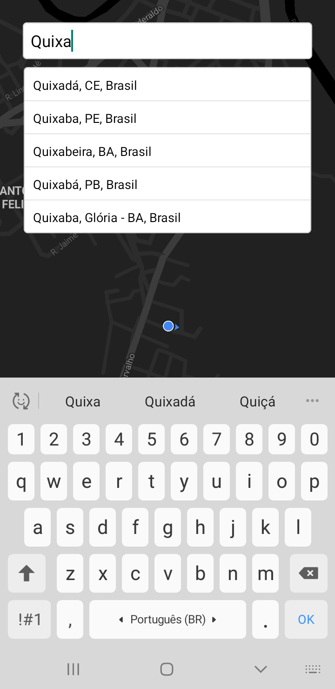
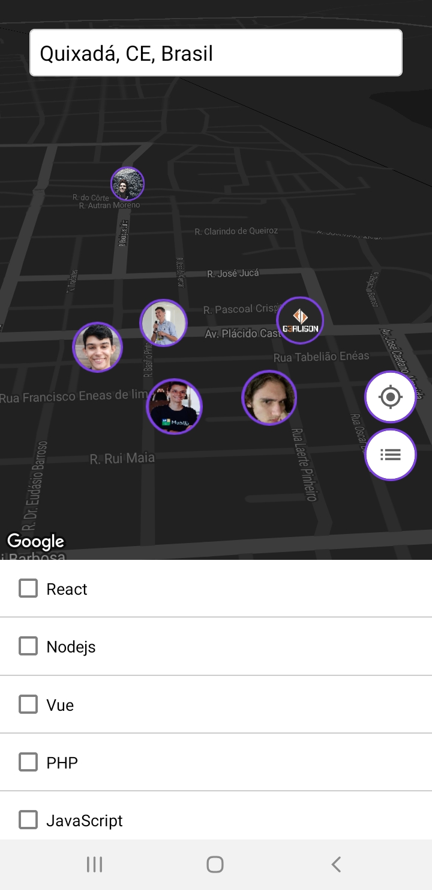

# Semana Omnistach 10 (Mobile)

Durante essa Semana Omnistack desenvolvi a seguinte aplicação com algumas melhorias da proposta pela a Rocketseat.

|Search Box|Marker|Select multiple|Callout|
|---|---|---|---|
|||||

## Clone, Instalação e Executar
### Clone
```
git clone https://github.com/uandersonmbc/semana-omnistack-10-mobile

cd semana-omnistack-10-mobile
```

### Instalar as dependências
```
yarn
ou
npm install
```

### Executando aplicação
```
yarn start
ou
npm start
```

## Principais dependências a serem instaladas
- axios
- expo-location
- react-native-maps
- react-native-select-multiple
- react-native-google-places-autocomplete
- react-native-webview
- react-navigation
- styled-components

## Organização das pastas

```
src
├───components
│   ├───MarkerDev
│   └───SearchBox
├───navigation
├───screens
│   ├───Edit
│   ├───GitHub
│   ├───Main
│   └───Register
├───services
└───shared
```
